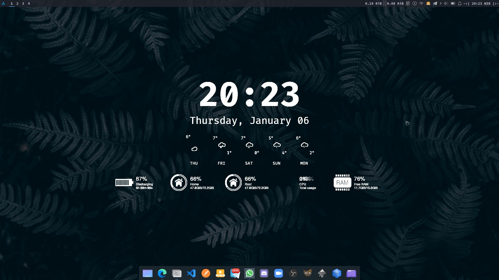
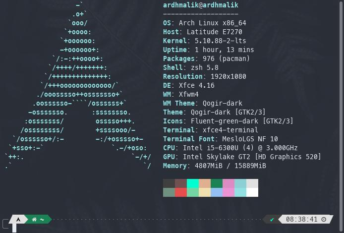

# **My Linux Setup (My Arch)**

I use this repository to store all my needs in Linux customization, especially Arch Linux. You can see My Desktop below

And this My Terminal

And, this link to customize My Arch

[Linux-Scoop](https://www.youtube.com/watch?v=TAWwJoYWq6s&t=998s&ab_channel=LinuxScoop)